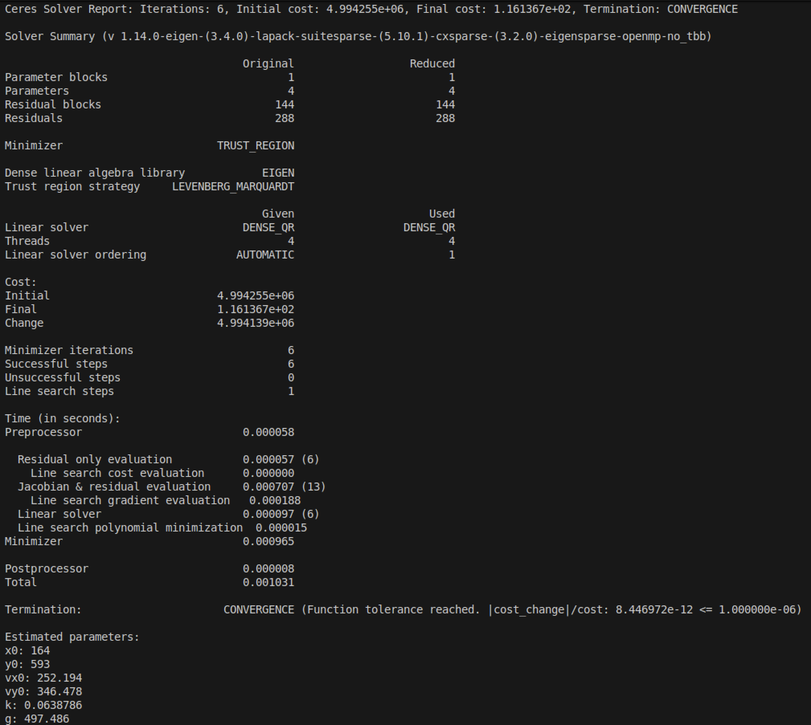

# XJTU-RMV-Task03
### 视觉组第三次作业
#### Ceres 应用：拟合小球弹道

**拟合模型——假设小球弹道满足：**

$$
x(t)=x_0+{v_{x0}\over k}(1-e^{-kt})
$$

$$
y(t)=y_0+{(v_{y0}+{g\over k})\over k}(1-e^{-kt})-{g\over k}t
$$

其中进行了屏幕坐标转换，将 *以左上角为原点，向右为* $x^+$*，向下为* $y^+$ *的坐标系* 转换为了 *以左下角为原点，向右为* $x^+$*，向上为* $y^+$ *的坐标系*。

参考数据：帧高度 $720$，帧宽度 $1280$。

-------------

拟合结果：

```
vx0: 252.194
vy0: 346.478
k: 0.0638786
g: 497.486
```

更多运行结果详见 `outputs/results.txt`


